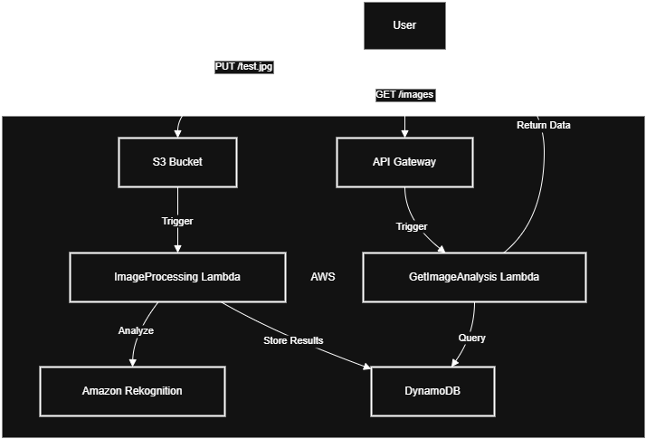

# 🖼️ AWS Serverless Image Processing Pipeline

[](https://github.com/musayounus/aws-image-processing)


An automated pipeline that analyzes images using AI (Amazon Rekognition), stores results in DynamoDB, and provides a REST API for querying.



## 🔍 Features
- **Automated Image Analysis**: Amazon Rekognition detects objects/labels in uploaded images
- **Serverless**: 100% AWS serverless components (Lambda, API Gateway, S3)
- **Scalable**: DynamoDB handles high-throughput requests
- **Secure**: IAM roles with least-privilege permissions
- **Monitoring Ready**: Integrated with CloudWatch and X-Ray

## 🛠️ Technologies
| Service          | Use Case                          |
|------------------|-----------------------------------|
| AWS Lambda       | Image processing & API handlers   |
| Amazon Rekognition | AI-powered image analysis        |
| DynamoDB         | Metadata storage                  |
| API Gateway      | REST API endpoint                 |
| S3               | Image storage                     |

## 🚀 Deployment

### Prerequisites
- AWS CLI configured (`aws configure`)
- Node.js 20.x
- [Postman](https://www.postman.com/) (for API testing)

### 1. Infrastructure Setup
```
chmod +x infrastructure/setup.sh
./infrastructure/setup.sh
```

### 2. Deploy Lambda Functions
### Image processing Lambda
```
cd lambdas/image-processing
zip -r function.zip .
aws lambda update-function-code --function-name ImageProcessing --zip-file fileb://function.zip
```

### API handler Lambda
```
cd ../api-handler
zip -r function.zip .
aws lambda update-function-code --function-name GetImageAnalysis --zip-file fileb://function.zip
```

## 🖥️ Usage
### Upload an Image
```
aws s3 cp test.jpg s3://your-bucket-name/ --acl private
```

### Query Results via API
```
curl https://your-api-id.execute-api.region.amazonaws.com/prod/images
```

### Sample Response:
```{
  "ImageId": "test.jpg",
  "Bucket": "your-bucket-name",
  "AnalysisDate": "2025-04-07T12:00:00Z",
  "Labels": [
    {
      "Name": "Dog",
      "Confidence": 98.76,
      "Instances": [],
      "Parents": [{"Name": "Animal"}]
    },
    {
      "Name": "Outdoor",
      "Confidence": 92.31
    }
  ]
}
```

## 📂 Project Structure
<pre>
aws-image-processing/
├── infrastructure/       # AWS setup scripts
├── lambdas/              # Lambda function code
│   ├── image-processing/ # S3 → Rekognition → DynamoDB
│   └── api-handler/      # API Gateway → DynamoDB
├── postman/              # API test collection
├── docs/                 # Diagrams & documentation
└── README.md             # You are here!
</pre>

## 🛡️ Security
### IAM Roles: Least-privilege permissions for all services

### Data Protection:
S3 server-side encryption (SSE-S3)
DynamoDB encryption at rest

### Access Control:
API Gateway with IAM authorization

## 📈 Monitoring
### CloudWatch:
Lambda execution logs
API Gateway metrics

### X-Ray:
End-to-end request tracing
Service map visualization

### Alarms:
Error rate monitoring
Latency thresholds

## 🤝 Contributing
Fork the project

Create a feature branch (git checkout -b feature/amazing-feature)

Commit changes (git commit -m 'Add amazing feature')

Push to branch (git push origin feature/amazing-feature)

Open a Pull Request
